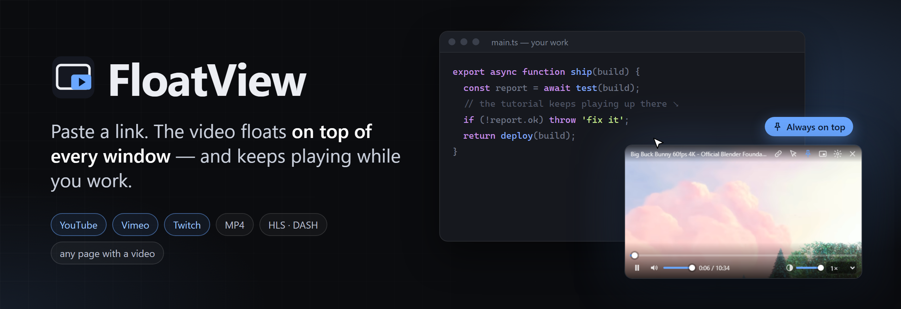
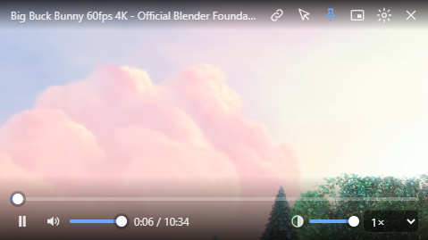
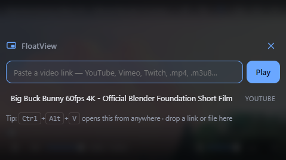
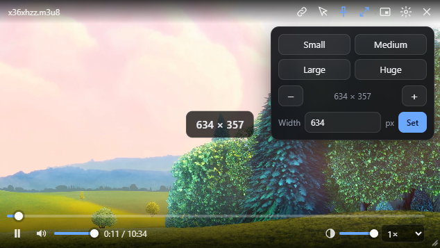

<p align="center">
  
</p>

<p align="center">
  
  
  
  
</p>

# FloatView

Paste a video link → it plays in a small floating window that **stays on top of every other window**.
Local only: no accounts, no telemetry, nothing leaves the PC except the video stream itself.

| Playing on top | Paste a link | Resize big or small |
|---|---|---|
|  |  |  |

## Install
Two builds (`npm run dist` → `dist\`):
- **`FloatView-Setup-0.1.1.exe`** — installs per-user (no admin) to `%LOCALAPPDATA%\Programs\FloatView` and adds a Start-menu shortcut.
- **`FloatView-0.1.1-portable.exe`** — one file, no install; double-click to run (first start takes a few seconds while it unpacks).

## Resize: big or small
- **Drag the grip** in the bottom-right corner (shows on hover). The window keeps the video's shape.
- **Size button** (↗↙ in the top bar): *Small* / *Medium* / *Large* / *Huge* (20 / 33 / 50 / 75 % of the screen width), **−** / **+** steps, or type an exact width in px.
- **Keys:** `Ctrl+Alt+=` bigger · `Ctrl+Alt+-` smaller (from any app), or `+` / `-` inside the window.
- The window edge also works: grab just outside the border, like any Windows window.
- A size label (e.g. `960 × 540`) appears while you resize. The window never grows past the screen.

## Use
- Paste a link and press **Play**, or press **Ctrl+V** anywhere in the window, or drag a link/file onto it.
- Hover to see the controls; they fade out after ~2 s.
- Drag the top bar to move. Drag an edge to resize. Near a screen edge, the window snaps to it.
- Closing (✕) hides the window to the tray. Quit from the tray menu or from Settings.

| Hotkey (works from any app) | Action |
|---|---|
| `Ctrl+Alt+Space` | Play / pause |
| `Ctrl+Alt+V` | Show FloatView and paste a new link |
| `Ctrl+Alt+T` | Click-through on/off (clicks go to the app behind) |
| `Ctrl+Alt+↑ / ↓` | Opacity ±10% |
| `Ctrl+Alt+← / →` | Seek −/+10 s |
| `Ctrl+Alt+H` | Hide / show |
| `Ctrl+Alt+P` | Always-on-top on/off |
| `Ctrl+Alt+=` / `Ctrl+Alt+-` | Bigger / smaller window |

Inside the window: `Space`/`K` play, `←/→` seek 5 s, `↑/↓` volume, `M` mute, `N` new link, `Esc` close panels.
In click-through mode, hover the lock in the top-right corner and click it to turn click-through off.

Hotkeys can be changed in `%APPDATA%\FloatView\floatview.json` (Settings → *Edit hotkeys…*), then restart.

## What plays
| Link | How |
|---|---|
| `.mp4 .webm .mov .mp3 …`, local files | built-in player |
| `.m3u8` (HLS), `.mpd` (DASH) | hls.js / dash.js |
| YouTube (watch, youtu.be, Shorts, live), Vimeo, Twitch | official embed player |
| Any other page (Facebook, TikTok, news sites…) | page opens in a sandbox, only its biggest video is shown |
| Sites with no player found | set **yt-dlp.exe** in Settings; FloatView asks it for the stream URL |

Not supported: DRM services (Netflix, Disney+, Prime Video, Spotify).

## Develop
```
npm install
npm start          # run the app
npm test           # unit tests (resolver, store)
npm run smoke      # end-to-end: launches the app, plays MP4/HLS/YouTube/Vimeo/web links
npm run dist       # build the installer into dist\
```
`SMOKE_EXE=dist\win-unpacked\FloatView.exe npm run smoke` runs the same test against the packaged build.
The banner is `docs/banner/banner.html`; re-render it with `powershell docs\banner\render.ps1`.

## Layout
```
src/main/main.js        window, always-on-top guard, tray, hotkeys, IPC, security
src/main/resolver.js    link → playback source (provider modules + yt-dlp bridge)
src/main/store.js       settings + history JSON in %APPDATA%\FloatView
src/preload.js          the only bridge between UI and main process
src/renderer/           UI (plain HTML/CSS/JS), players.js = native + webview players
src/renderer/inject/    script injected into web pages to find and drive the <video>
```

## Known limits
- Some old videos use an encoding Electron can't decode (e.g. vimeo.com/76979871). FloatView shows "This video is stuck" and offers *Open in browser*.
- Games in *exclusive* full-screen draw above every window. Borderless full-screen is fine.
- Drag-and-drop onto a web-page video doesn't work (the page takes the drop). Use Ctrl+V instead.
